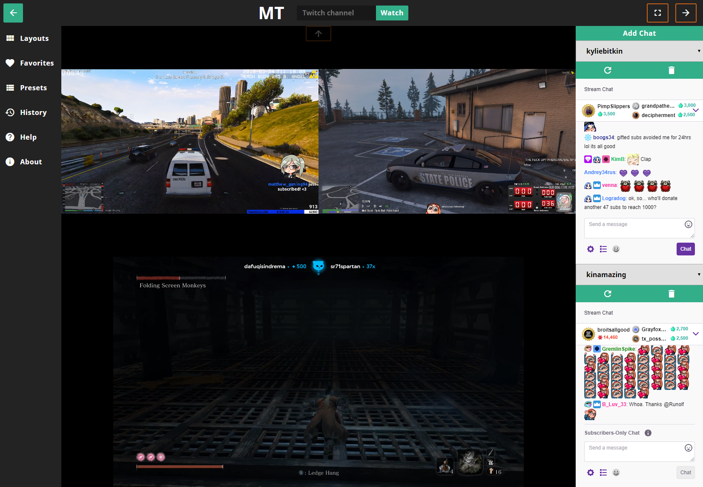

## manytwitch
### Multiple Twitch stream viewer

Live at www.danielhearn.co.uk/manytwitch

Built with VueJS, SCSS,and gulp for workflow tools.
Hosted on github pages.

To specify a channel within the url use 'manytwitch/?stream=channel1,channel2' creating a list of the channels seperated with commas.

### Dependencies
- vue draggable to handle model updating on list reorder with drag and drop.
- screenfull.js for quick and clean access to browser fullscreen api.

### Gulp tasks
- Watch: Use browsersync to reload files and compiles pug and scss.
- Build: Compiles pug and scss and builds files from src to dist, including compressing images, js, css

### Contributions

Contributions are welcome especially those which improve functionality and user experience.
To contribute please fork and send a pull request, to request a feature or report bugs please open an issue.
