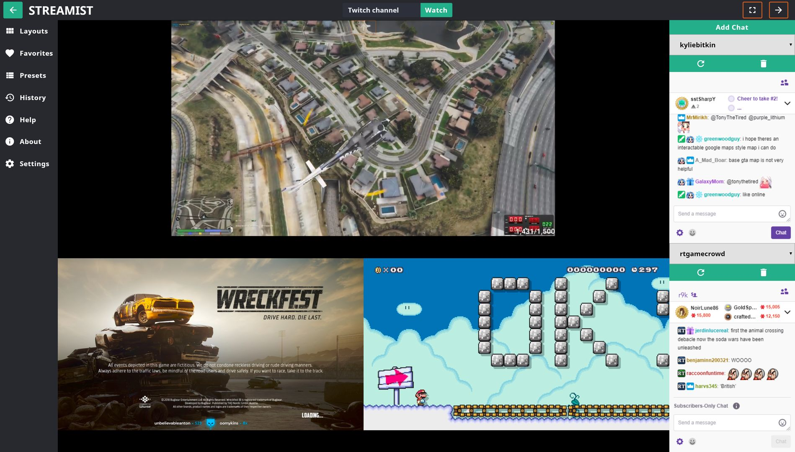

## Streamist 
### Multiple Twitch stream viewer

Live at www.danielhearn.co.uk/streamist

Built with VueJS, SCSS, webpack for workflow automation.
Hosted on github pages.

## Features
- Watch multiple twitch streams and chats
- Recent channel history
- Favorite channels
- Channel presets -> For quick access to regularly watched groups of channels

To specify a channel within the url use 'streamist/?stream=channel1,channel2' creating a list of the channels seperated with commas.

## Dependencies
- vue draggable to handle model updating on list reorder with drag and drop.
- date fns for readable relative date for stream history.
- webpack for bundling and building

## Tasks
- 'npm run watch': Watch with webpack dev server
- 'npm run build': Build production files 
- 'npm run test': Run tests
- 'npm run deploy': Build and deploy dist to gh-pages branch

## Contributions

Contributions are welcome especially those which improve functionality and user experience.
To contribute please fork and send a pull request, to request a feature or report bugs please open an issue.
